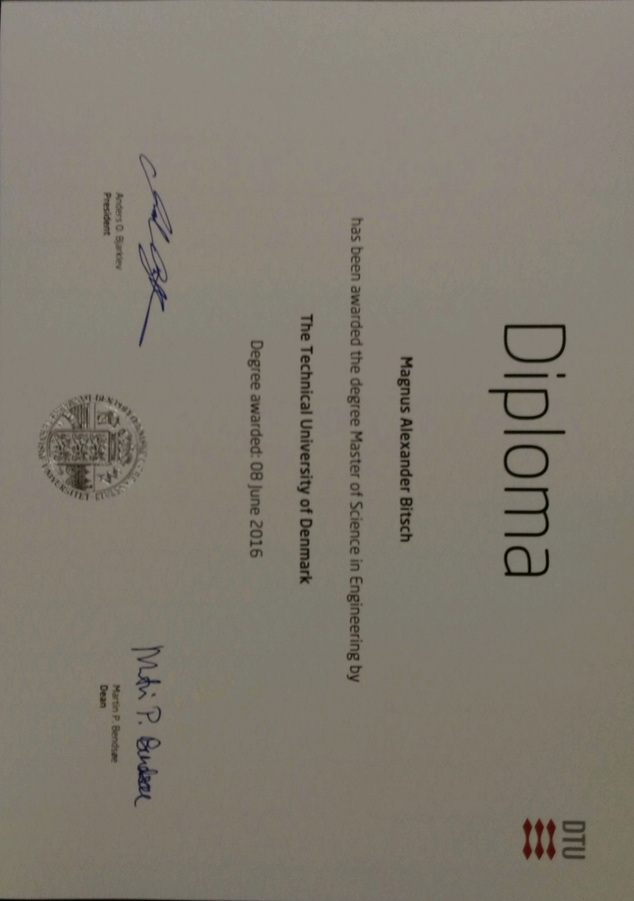

# Magnus Aleaxander Bitsch

#### November 2022

## Personal Information

`Born` Copenhagen, Denmark, October 12th 1990  
`Adress` Fredericiagade 21D, st., 1310 Copenhagen K  
`Email` [magnusbitsch@gmail.com](mailto:magnusbitsch@gmail.com)  
`Website` [LinkedIn](https://dk.linkedin.com/pub/magnus-alexander-bitsch/a3/30/270)  
`Phone` +45 26 30 48 94  

## Goal

I am a self-motivated and problem solving individual who is always keen to learn and improve skills.

### Data Science

A degree in mathematical modelling and computation as an engineer combined
with work experience in Data Science both internal and as a consultant has provided me with the skill set to model any data you throw at me through a wide variety of mathematical and
statistical tools which I always seek to improve.  

### American Football

Playing american football at the top level in Denmark as a captain of the
Copenhagen Towers and the Danish National Team has embraced my natural
leadership abilities and taught me how to be a team player.

## Skills

  

| **Algorithms**                    | **DevOps**        | **Stakeholder Management**                    |
|:----------------------------------|:------------------|:----------------------------------------------|
| $\bullet$ Machine Learning        | $\bullet$ Azure   | $\bullet$ Natural Leader - Team Captain       |
| $\bullet$ Deep Learning           | $\bullet$ MLOps   | $\bullet$ Communication to nontechnical       |
| $\bullet$ Time Series Analysis    | $\bullet$ Git     | $\bullet$ Self-motivated                      |
| $\bullet$ Statistical Modelling   | $\bullet$ CI/CD   | $\bullet$ Problem Solving                     |
|                                   |                   |                                               |

## Education

### Masters of Mathematical Modelling and Computation

`2014 - 2016` **The Technical University of Denmark, Lyngby**

GPA: 11.3 - *Master (MSc) / Civilingeniør, cand. polyt.*

*Focus areas*: Industrial and applied statistics, and Stochastic dynamical modelling  
*Thesis*: Statistical Learning for Energy Informatics (Grade: 12 (A))  
*Description*: Applied mathematics and mathematical modelling as well as use
of modern computer equipment and analysis of large data volumes. A Strong
foundation in industrial statistics techniques such as design of experiments,
statistical process control, process capability analysis, reliability analysis, etc.
Tools in analyzing and modelling dynamical systems based on available time
series of data which can be applied within important areas like finance,
pharmaceutics, biology, and energy production (wind, solar, ..).  
*Link*: [Mathematical Modelling and Computation](http://www.dtu.dk/english/Education/msc/Programmes/mathematical_modelling_and_computation)

### Bachelor of Mathematics and Technology

`2010 - 2014` **The Technical University of Denmark, Lyngby**

GPA: 7.9 - *Bachelor (BEng and BSc)*

*Description*: Sound mathematical foundations and experience in developing
and running mathematical models in different fields.  
*Thesis*: Prediction of Real Estate Prices (Grade: 10 (B))  
*Link*: [Mathematical Modelling and Computation](http://www.dtu.dk/english/Education/msc/Programmes/mathematical_modelling_and_computation)

### Exchange Student, 1 Semester

`Fall 2012` **Oregon State University, Oregon, USA**  

*Description*: Exchange through DTU.  

### HTX Sukkertoppen

`2006 – 2010` **HTX Sukkertoppen, Valby**

*Description*: High School (Gymnasium).

### Waynesfield Goshen High School

`2007/2008` **Waynesfield Goshen High School, Ohio, USA**

*Description*: High School, 11th  grade ”Junior year”. Exchange through YFU.

## Work Experience

### Senior Data Science Architect

`2022 -` **Kapacity A/S, Copenhagen**

*Area*: Kapacity AI  
*Description*: Working with predictive modelling, statistics, data mining, machine learning and deep learning primarily using the Azure cloud platform. Framework for comparing and selecting output from
competing models in production. Primary areas: Churn, cross-sales, CLV.  

Converting Machine Learning and advanced statistical analysis into concrete data products targeted at various businesses.  
A Senior Data Science Architect has several years of experience deploying Data Science models in production in customer environments, both on premise and Azure cloud. The have broad and deep experience with Data Science methods, tools and algorithms and know how to deploy each of these models to production. They can facilitate a business discussion and design the data science architecture to match customers’ requirements to data environment.  
The profile secures that team members and colleagues are up to date on Kapacitys Best Practice for implementing. Data Science methods, based on i.e infrastructure-as-code, CI/CD pipelines, DevOps methods, Docker containers and virtual analysis environments.  
*Link*: [Kapacity](https://kapacity.dk/)  

### Senior Data Scientist

`2019 - 2022` **Kapacity A/S, Copenhagen**

*Area*: Kapacity AI  
*Description*: Senior data scientist in BI consultancy. Working with predictive modelling, statistics, data mining, machine learning and deep learning primarily using the Azure cloud platform. Framework for comparing and selecting output from
competing models in production. Primary areas: Churn, cross-sales, CLV.  

Converting Machine Learning and advanced statistical analysis into concrete data products targeted at various businesses.  
A Senior Data Science Architect has several years of experience in putting Data Science models into production on the customer's environment, whether on-premise or Azure cloud. They have a broad understanding of Data Science methods, tools and algorithms and know processes with production setting of models within each. They know how to drive the business dialogue and to adapt the setup of the data science architecture to the customer's other wishes for the data environment.  
The profile actively works to ensure that employees and colleagues seek knowledge and sparring relationships regarding Kapacity's Best Practice implementation within Data Science methods, which are based on the use of infrastructure-as-code, CI/CD pipelines, DevOps methods, Docker containers and virtual analysis environments.  
*Link*: [Kapacity](https://kapacity.dk/)  

### Chapter Lead and Senior Data Scientist

`2019 - 2019` **Nuuday (TDC Group), Copenhagen**

*Area*: Commercial Data Science  
*Description*: Chapter lead and senior data scientist supervising 8 data scientist and collaborating with stakeholders. Working with predictive modelling, statistics, data mining, machine learning and deep learning. Framework for comparing and selecting output from competing models in production. Primary areas: Churn, cross-sales, CLV, maintaining models in production.  
*Reference*: Jonas Munk | [jmu@nuuday.dk](mailto:jmu@nuuday.dk)  
*Link*: [TDC Group](https://tdcgroup.com/)

### Data Scientist

`2016 - 2019` **TDC Group, Copenhagen**

*Area*: AI & Robotics  
*Description*: Working with predictive modelling, statistics, data mining, machine learning and deep learning. Framework for comparing and selecting output from competing models in production. Primary areas: Churn, cross-sales, CLV, invoice classification, maintaining models in production, supervising junior data scientists and collaborating with stakeholders.  
*Reference*: Jonas Munk | [jmu@nuuday.dk](mailto:jmu@nuuday.dk)  
*Link*: [TDC Group](https://tdcgroup.com/)

### Student Data Analyst

`2015 – 2016` **The Technical University of Denmark, Lyngby**

*Area*: DTU Statistical Consulting Center  
*Description*: Developing statistical reports for internally and externally use in collaboration with professors in the Department of Applied Mathematics and Computer Science.  
*Reference*: Bjarne Kjær Ersbøll | [bker@dtu.dk](mailto:bker@dtu.dk)

### Student Employee

`2013 – 2015` *MEGAFON, Frederiksberg*

*Area*: Data  
*Description*: In the department of data I set up of questionnaires for online or phone interviews. Furthermore, I tested ongoing questionnaires and created reports based on completed questionnaires. Smaller tasks included maintaining databases, weighting of questionnaire answers and overseeing the completion of questionnaires.  
*Reference*: Ulrik S. Nielsen | [usn@megafon.dk](mailto:usn@megafon.dk)  
*Link*: [MEGAFON](https://www.megafon.dk/)

### Math Teacher

`2011 – 2014` *KEA, Copenhagen*

*Area*: Københavns Erhvervs Akademi  
*Description*: Three semesters of teaching 1st year math for electricians who studied to
become qualified electricians.

## Computer Skills

### Advanced

Python | R | Docker | Azure | Azure DevOps Pipelines | MLOps | Bicep | Interpretable Machine Learningen

### Intermediate

SQL | Databricks | Git | Bash | Markdown | LaTeX | R-Sweave | Shiny

### Basic

Matlab | SAS | Java | C

## Articles

### Wolf et al., 2019

`2019` *A markov-switching model for building occupant activity estimation.*

Wolf, S., Møller, J. K., Bitsch, M. A., Krogstie, J., & Madsen, H. (2019). A Markov-Switching model for building occupant activity estimation. Energy and Buildings, 183, 672-683. https://doi.org/10.1016/j.enbuild.2018.11.041

### Lange et al., 2016

`2016`

*Symptoms and quality of life in patients with chronic obstructive pulmonary disease treated with aclidinium in a real-life setting.*

Lange, Peter & Godtfredsen, Nina & Olejnicka, Beata & Paradis, Bo-Anders & Curiac, Dan & Humerfelt, Sjur & Telg, Gunilla & Christensen, Helene & Bitsch, Magnus & Andersen, Elisabeth & Bjermer, Leif. (2016). Symptoms and quality of life in patients with chronic obstructive pulmonary disease treated with aclidinium in a real-life setting. European Clinical Respiratory Journal. 3. 10.3402/ecrj.v3.31232.

## Other Information

### Exchange Student

`Fall 2012` Oregon State University

`2007/2008` Waynesfield Goshen High School (Jr./11th grade), Ohio, USA

### Languages

*Danish*: Mothertongue  
*English*: Full professional proficiency  
*Deutsch*: Basic (simple words and phrases only)  

### Interests

American football | Sports in general | Challenges

## Awards

### Copenhagen Towers American Football

`2012 - ` Team Captain

`2022` National Champion  

`2021` National Champion  

`2019` National Champion (2nd)  

`2018` National Champion  

`2017` National Champion, Most Valuable Player (Team), Most Valuable Player (Mermaid Bowl - National Championship)

`2016` National Champion  (2nd)

`2014` National Champion, Best Defensive Player (Team)

`2013` National Champion, Most Valuable Player (Team)

`2011` Best Defensive Player (Team)

### Danish National Team American Football 

`2016 - ` Team Captain

`2018` European Championship (6th)

`2014` European Championship (6th)

`2013`  European Championship (1st) (B-group)

## Appendix

### Grades Master

  

<embed src="grades_master_magnus_bitsch.pdf" type="application/pdf" width="600" height="910">

### Grades Bachelor

  

<embed src="grades_bachelor_magnus_bitsch.pdf" type="application/pdf" width="600" height="910">

### Grades Bachelor

  

<!-- 

### Footer

Last updated: May 2013
-->

